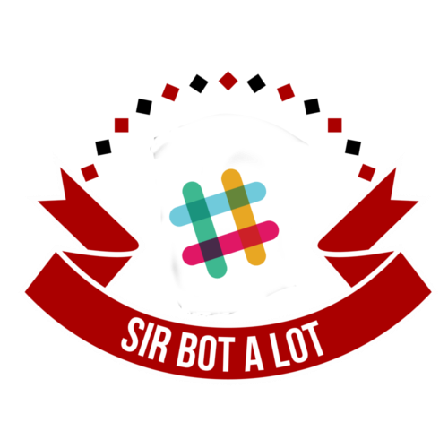

======
|icon|
======

|build| |doc|

`Sir-bot-a-lot`_ slack plugin built for the people and by the people of the `python developers slack community`_.

Want to join? `Get an invite`_ !

.. _Get an invite: http://pythondevelopers.herokuapp.com/
.. _python developers slack community: https://pythondev.slack.com/
.. |build| image:: https://travis-ci.org/pyslackers/sirbot-slack.svg?branch=master
    :alt: Build status
    :target: https://travis-ci.org/pyslackers/sirbot-slack
.. |doc| image:: https://readthedocs.org/projects/sirbot-plugin-slack/badge/?version=latest
    :alt: Documentation status
    :target: http://sirbot-plugin-slack.readthedocs.io/en/latest/

Installation
------------

**WARNING** Sirbot-slack require `sir-bot-a-lot`_.

The sources for sirbot-slack can be downloaded from the `github repo`_.

.. code-block:: console

    $ git clone https://github.com/pyslackers/sirbot-slack

Once you have a copy of the source, you can install it with:

.. code-block:: console

    $ pip install git+https://github.com/pyslackers/sir-bot-a-lot
    $ pip install sirbot-slack/

To install the development requirements do:

.. code-block:: console

    $ pip install sirbot-slack/[dev]

.. _sir-bot-a-lot: http://sir-bot-a-lot.readthedocs.io/en/latest/
.. _github repo: https://github.com/pyslackers/sirbot-slack

Authentication
--------------

To connect to slack you either need to create a bot or an app. An app can also contain a bot.

Tokens must be supplied by environment variable:
    - ``SIRBOT_SLACK_BOT_TOKEN``: Bot token
    - ``SIRBOT_SLACK_TOKEN``: App token
    - ``SIRBOT_SLACK_VERIFICATION_TOKEN``: App verification token

Configuration
-------------

The default configuration for sirbot-slack look like this:

.. code-block:: yaml

    slack:
      save:
        messages: false
        events: false
        commands: false
        actions: false
      refresh:
        user: 3600
        channel: 3600
      plugins:
        - sirbot_plugin_slack.example
